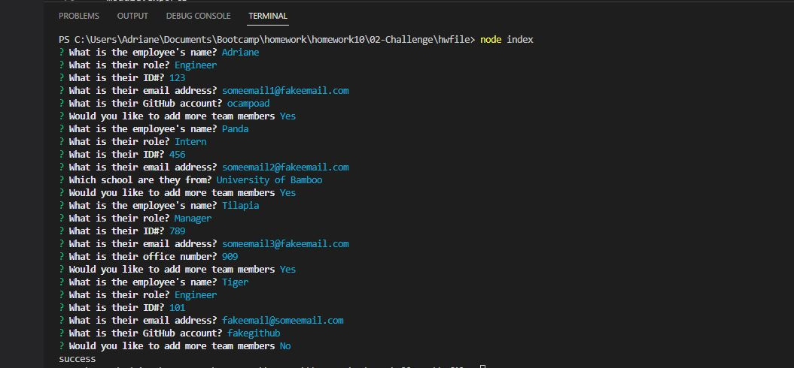
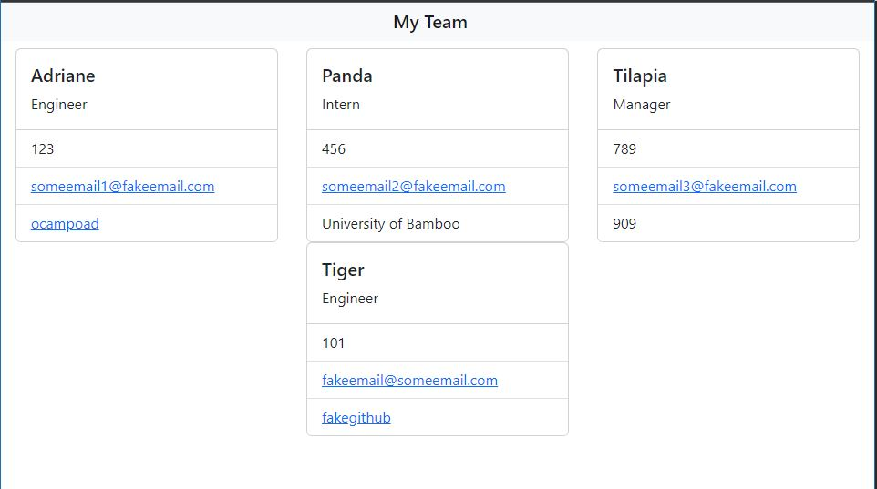

# Project Name - Team Profile Generator
​
## Table of contents
​
- [Overview](#overview)
  - [The challenge](#the-challenge)
  - [User Story](#user-story)
  - [Acceptance Criteria](#acceptance-criteria)
  - [Screenshot](#screenshot)
  - [Links](#links)
- [My process](#my-process)
  - [Built with](#built-with)
  - [What I learned](#what-i-learned)
  - [Continued development](#continued-development)
  - [Useful resources](#useful-resources)
- [Author](#author)


## Overview
​
### The challenge
​
This week's challenge inlude creating a command-line application that will generate a webpage that renders employees summaries. 
​
### User Story
​
```
AS A manager
I WANT to generate a webpage that displays my team's basic info
SO THAT I have quick access to their emails and GitHub profiles
```
​
### Acceptance Criteria
​
```
GIVEN a command-line application that accepts user input
WHEN I am prompted for my team members and their information
THEN an HTML file is generated that displays a nicely formatted team roster based on user input
WHEN I click on an email address in the HTML
THEN my default email program opens and populates the TO field of the email with the address
WHEN I click on the GitHub username
THEN that GitHub profile opens in a new tab
WHEN I start the application
THEN I am prompted to enter the team manager’s name, employee ID, email address, and office number
WHEN I enter the team manager’s name, employee ID, email address, and office number
THEN I am presented with a menu with the option to add an engineer or an intern or to finish building my team
WHEN I select the engineer option
THEN I am prompted to enter the engineer’s name, ID, email, and GitHub username, and I am taken back to the menu
WHEN I select the intern option
THEN I am prompted to enter the intern’s name, ID, email, and school, and I am taken back to the menu
WHEN I decide to finish building my team
THEN I exit the application, and the HTML is generated
```
​
### Screenshot
​


​
​
### Links
​
- Recording: [https://drive.google.com/file/d/1Z0ciLQAZufbdsMmqmSYQW843fh9SWUzU/view?usp=sharing](https://drive.google.com/file/d/1Z0ciLQAZufbdsMmqmSYQW843fh9SWUzU/view?usp=sharing)
​
## My process
​
### Built with
​
- Javascript
    - classes
- NPM:
    - Inquirer
    - Fs
    - Jest
- module.exports

### What I learned
​
I learned how to use some of NPM packages. The main ones I used in this challenge are Inquirer, FS, and Jest. The NPM documentation for each package does vary in detail but they are helpful in figuring out how to use.  

### Continued development
​
There are so many NPM dependencies that can be used and wish to explore more of them. I had a simple test for Jest and I look forward to working in the field and make features from tests cases.
​
### Useful resources
​
- [NPM Inquirer](https://www.npmjs.com/package/inquirer) - Documentation helped me understand how to use this package
- [Stackoverflow](https://stackoverflow.com/) - Great resource of other developers helping other developers. They answered specific questions others have encountered. 
​
## Author
​
- Website - [Adriane Ocampo](https://ocampoad.github.io/Adriane_Ocampo_Portfolio/)
​
